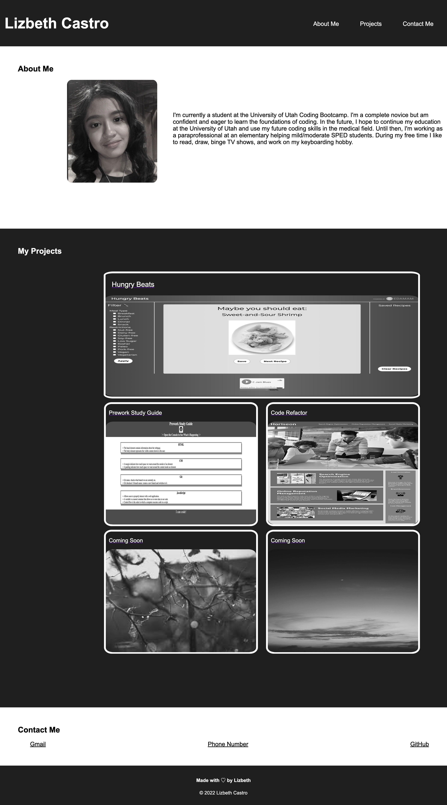

# Professional Portfolio
## Description 
For this project, we made a professional portfolio for potential employers. This was the first project to require HTML and CSS files made completly from scratch which drastically improved my coding skills. My motivation for building this project was to improve my CSS skills. I struggled with this skill for weeks and was determined to figure it out as it's essential for other coding skills. The page itself explains what I learned. I had no idea how to make a portfolio from scratch and am determined to improve it once I get the hang of it more. 
## Installation 
N/A
## Deployed Site 
https://lizcas01.github.io/professional-portfolio/
## Usage 

To use this portfolio, click on the small text on the navigation bar to take you to the desired page section. You can also click on the pictures under "My Projects" to check out the work I've done so far. 
## Credits
N/A
## License
Please refer to the LICENSE in the repo.  
